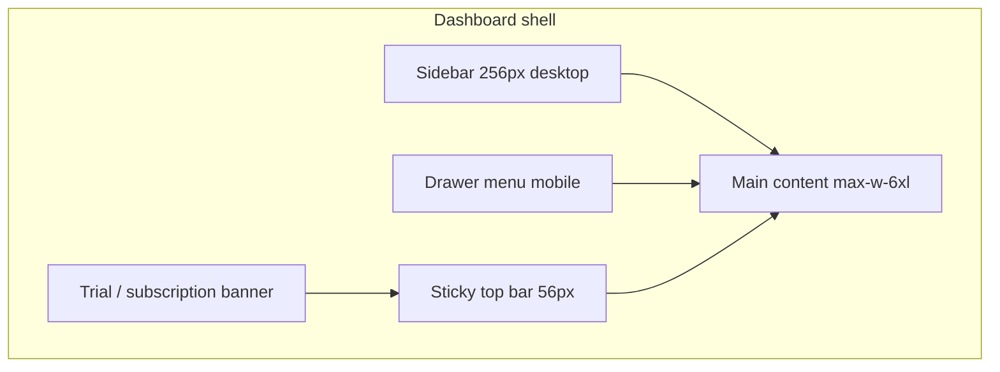

# LoyalQR — Admin Dashboard Design Specification

**Product:** LoyalQR (Iceking Card platform)  
**Audience:** Business owners (`owner` role)  
**Base route:** `/dashboard`  
**Last updated:** June 2026

---

## 1. Design intent

The admin dashboard is the **owner control center** for a multi-tenant loyalty SaaS. It should feel:

- **Professional and calm** — light workspace, clear hierarchy, no visual noise
- **Operational** — KPIs and alerts first; deep CRM/tools one click away
- **Branded per tenant** — sidebar shows the shop name; tenant colors flow to customer-facing cards
- **SaaS-aware** — trial countdown, billing, and plan paywalls are visible but not intrusive

The marketing site shares the **same light product shell** as the dashboard (`bg-muted/20`, `bg-card`, primary `#1A56DB`, secondary `#0E9F6E`) for a continuous owner journey from landing → signup → dashboard.

---

## 2. Layout architecture



### 2.1 Shell component

**File:** `src/components/layout/dashboard-layout.tsx`

| Region | Desktop | Mobile |
|--------|---------|--------|
| Sidebar | Fixed left, `w-64`, `bg-card`, border-right | Hidden |
| Navigation | Vertical list in sidebar | HeroUI `Drawer` from left (`w-72`) |
| Top bar | Sticky `h-14`, hamburger + user name | Same |
| Main | `p-4 md:p-6 lg:p-8`, centered `max-w-6xl` | Same |
| Page background | `bg-muted/20` | Same |

### 2.2 Trial / billing banner

**File:** `src/components/billing/trial-banner.tsx`

Sits **above** the top bar, full width.

| State | Visual | CTA |
|-------|--------|-----|
| Active trial | Amber background (`amber-500/10`), clock icon | “Voir les plans” → `/dashboard/billing` |
| Expired trial / subscription | Red destructive tint, warning icon | “Mettre à niveau” → `/dashboard/billing` |
| Paid active plan | Hidden | — |

Copy (French): days remaining, limits (100 clients · 50 scans/day on trial).

### 2.3 Sidebar brand block

- **Mascot:** `Mascot` component, `role="admin"`, size `sm`, static (no entrance animation)
- **Title:** `settings.businessName` or fallback app name, `text-primary`, truncated
- **Subtitle:** “Admin dashboard”, `text-xs text-muted-foreground`
- **Logout:** Bottom of sidebar / drawer footer, ghost button, destructive text

### 2.4 Top bar

- Left: menu button (mobile only), `aria-label="Open navigation menu"`
- Right: owner `fullName`, `text-sm font-medium`
- No global search in v1 (search is per-page)

### 2.5 Page transitions

**File:** `src/components/layout/page-transition.tsx`

Wrapped around nested dashboard routes in `App.tsx`. Uses Framer Motion `pageVariants` for subtle enter animation on route change.

---

## 3. Navigation

### 3.1 Primary nav items

| Label | Path | Icon (Lucide) | Purpose |
|-------|------|---------------|---------|
| Overview | `/dashboard` | `LayoutDashboard` | KPIs + charts |
| Analytics | `/dashboard/analytics` | `BarChart3` | Extended metrics |
| Clients | `/dashboard/clients` | `Users` | CRM list |
| Contacts | `/dashboard/contacts` | `Contact` | Export / contact tools |
| Scans | `/dashboard/scans` | `QrCode` | Scan log |
| Fraud | `/dashboard/fraud` | `ShieldAlert` | Blocked scans |
| Rewards | `/dashboard/rewards` | `Gift` | Earned / redeemed rewards |
| Products | `/dashboard/products` | `Package` | Product catalog |
| Workers | `/dashboard/workers` | `Users` | Staff accounts |
| Billing | `/dashboard/billing` | `CreditCard` | Plans, Chargily, receipts |
| Settings | `/dashboard/settings` | `Settings` | Shop config |

### 3.2 Nav item styling

```
Default:  rounded-xl px-3 py-2.5, text-foreground, hover:bg-muted
Active:   bg-primary text-white
Icon:     h-4 w-4, left of label
```

Active state is determined by matching current path to `/dashboard` + item path.

### 3.3 Secondary routes (not in sidebar)

| Route | Purpose |
|-------|---------|
| `/dashboard/clients/:id` | Client profile |
| `/dashboard/onboarding` | Post-signup 3-step wizard |
| `/dashboard/billing` | Also linked from trial banner |

---

## 4. Visual design system

### 4.1 Color tokens

**File:** `src/index.css` (`:root`)

| Token | Value | Usage |
|-------|-------|--------|
| Primary | `#1A56DB` (HSL 221 83% 48%) | Active nav, charts, links, KPI accent |
| Secondary | `#0E9F6E` | Success, enrolment chart, positive KPIs |
| Destructive | Red | Fraud, errors, expired subscription |
| Background | Cool light gray `210 20% 98%` | App canvas |
| Card | White | Panels, sidebar, top bar |
| Muted | Light gray | Hover states, secondary text |
| Border | `#E5E7EB` family | Dividers, card edges |

**Dark mode:** Tokens defined under `.dark` — dashboard inherits system/theme if enabled.

### 4.2 Typography

| Element | Classes |
|---------|---------|
| Page title | `text-3xl font-bold tracking-tight` |
| Card title | `text-sm font-medium text-muted-foreground` (KPI) or `CardTitle` |
| KPI value | `text-3xl font-bold` |
| KPI delta | `text-xs text-muted-foreground` |
| Body | `font-sans` (Inter) via `--app-font-sans` |

### 4.3 Radius & elevation

- Global radius: `--radius: 0.75rem` (12px)
- Nav items: `rounded-xl`
- Cards: default shadcn `Card` + optional `shadow-sm`
- Utility: `.hover-elevate` for interactive lift on hover

### 4.4 Iconography

- **Lucide React** for all UI icons (16–20px in nav and KPI headers)
- **Brand mascots** (`/admin-icon.png`) for personality on Overview and sidebar only — not on every page

---

## 5. Component patterns

### 5.1 KPI stat cards

Used on Overview (and similar on Analytics).

```
Card
├── border-l-4 border-l-{semantic-color}   ← primary | secondary | destructive
├── CardHeader (icon top-right, muted title)
└── CardContent (large number + subtitle)
```

Semantic left border colors:

- **Primary** — Total clients
- **Secondary** — Scans today
- **Accent** — Pending rewards
- **Destructive** — Fraud alerts

### 5.2 Alert / action cards

Fraud banner on Overview:

- `border-l-4 border-l-destructive`
- `bg-destructive/5`
- Icon + short copy + primary destructive button → `/dashboard/fraud`

### 5.3 Data tables (Clients, Scans, Workers, etc.)

- **Toolbar:** search input with left `Search` icon, filters via `Select`
- **Table:** shadcn `Table` inside `Card`
- **Row actions:** icon buttons (`Eye`, `Ban`, etc.)
- **Pagination:** simple prev/next at bottom
- **Badges:** `Badge` for status (active / blocked)

### 5.4 Charts

**Library:** Recharts  
**Height:** `300px` in card body  
**Style:**

- Horizontal grid only, `#E5E7EB` dashed
- No axis lines; muted tick labels `#6B7280`
- Line stroke: primary or secondary CSS variable, `strokeWidth={3}`
- Tooltip: rounded 8px, light shadow, no border

### 5.5 Settings (tabbed)

**File:** `src/pages/dashboard/settings.tsx`

| Tab | Contents |
|-----|----------|
| General | Business name, logo URLs, colors, currency, timezone, language |
| Fidelity | Stamp threshold, max scans/day, milestones editor, product tracking toggle |
| Integrations | WhatsApp + Email (behind `PlanPaywall` where required) |
| Links | Portal URLs + shop QR |

Save pattern: section-level “Save” buttons + toast feedback.

### 5.6 Plan paywall

**File:** `src/components/billing/plan-paywall.tsx`

Replaces locked integration UI with dashed amber border card + “Mettre à niveau” → billing.

### 5.7 Loading states

- Overview: skeleton cards in 4-column grid
- Tables: empty / loading via query `isLoading` (page-level patterns vary)

### 5.8 Toasts

shadcn `Toaster` — success on save, destructive on errors. Used across dashboard mutations.

---

## 6. Page-by-page summary

### Overview (`/dashboard`)

**File:** `src/pages/dashboard/index.tsx`

1. Header: floating admin mascot + “Dashboard” title
2. Conditional fraud alert card
3. 4 KPI cards (2 cols mobile → 4 cols desktop)
4. Quick action row: outline buttons → Scans, Contacts, Rewards, Fraud
5. Two line charts: Daily Scans (30d), Daily Enrolments (30d)

Motion: `fadeUp` on mount.

### Analytics (`/dashboard/analytics`)

Extended charts and sales metrics (same card/chart language as Overview).

### Clients (`/dashboard/clients`)

Searchable paginated CRM table; block/unblock; navigate to profile.

### Client profile (`/dashboard/clients/:id`)

Timeline of scans and rewards; notes; GDPR-style anonymise delete.

### Contacts (`/dashboard/contacts`)

CSV export and contact-oriented views.

### Scans (`/dashboard/scans`)

Chronological scan log with status filters.

### Fraud (`/dashboard/fraud`)

Blocked scans highlighted; review notes where applicable.

### Rewards (`/dashboard/rewards`)

Pending vs redeemed rewards tables.

### Products (`/dashboard/products`)

CRUD for catalog linked to worker scan flow.

### Workers (`/dashboard/workers`)

Create/deactivate workers; QR tokens for staff scanning.

### Billing (`/dashboard/billing`)

**File:** `src/pages/dashboard/billing.tsx`

- Current plan + trial end date
- Monthly / annual toggle
- Plan cards: Chargily checkout + BaridiMob receipt upload
- Bank details from `platform_settings`

### Onboarding (`/dashboard/onboarding`)

**File:** `src/pages/dashboard/onboarding.tsx`

3-step linear wizard with progress bars:

1. Branding (primary color)
2. Fidelity (stamp threshold)
3. Shop QR (`/{slug}/client`)

### Settings (`/dashboard/settings`)

Full shop configuration; tenant-scoped via RLS.

---

## 7. Responsive behavior

| Breakpoint | Behavior |
|------------|----------|
| `< lg` (1024px) | Sidebar hidden; drawer navigation |
| `≥ lg` | Persistent sidebar |
| KPI grid | `grid-cols-2` → `lg:grid-cols-4` |
| Chart grid | `md:grid-cols-2` stacked on mobile |
| Main padding | Scales `p-4` → `p-8` |

Touch targets: mobile menu button `min-h-10 min-w-10`.

---

## 8. Authentication & access

- **Guard:** `ProtectedRoute` with `role="owner"` in `App.tsx`
- **Login:** `/admin` → redirects to `/dashboard` when authenticated
- **Logout:** Clears session → `/admin`
- **Data scope:** All queries tenant-scoped via Supabase RLS (`tenant_id` from owner profile)

Workers use a **separate** app shell at `/worker` (mobile-first, not documented here).

---

## 9. Motion & accessibility

| Concern | Implementation |
|---------|----------------|
| Route transitions | Framer Motion `PageTransition` |
| Overview entrance | `fadeUp` variant |
| Mascot | Optional float animation on Overview only |
| Skip link | `SkipLink` → `#main-content` |
| Focus | shadcn components; sticky header `z-10` |
| Reduced motion | `MotionConfig reducedMotion="user"` in `App.tsx` |

---

## 10. SaaS-specific UX rules

1. **Trial banner** always visible during trial or after expiry — never blocks content, only informs.
2. **Billing** is a first-class nav item, not buried in Settings.
3. **WhatsApp / campaigns** gated by plan — show paywall, not broken forms.
4. **Shop name** in sidebar updates from `shop_settings` after branding changes.
5. **Customer URLs** use tenant slug: `/{slug}/client`, `/{slug}/card/{code}` (shown in Settings → Links and Onboarding).

---

## 11. Key source files

| Area | Path |
|------|------|
| Shell layout | `src/components/layout/dashboard-layout.tsx` |
| Trial banner | `src/components/billing/trial-banner.tsx` |
| Plan paywall | `src/components/billing/plan-paywall.tsx` |
| Design tokens | `src/index.css` |
| UI primitives | `src/components/ui/*` (shadcn) |
| HeroUI | `@heroui/react` (Drawer, Button) |
| Routes | `src/App.tsx` (`/dashboard` nest) |
| Tenant context | `src/lib/tenant-context.tsx` |
| Brand mascot | `src/components/brand/mascot.tsx` |
| Motion presets | `src/lib/motion.ts` |

---

## 12. Future design considerations (not yet built)

- French localization for all dashboard strings (marketing is FR; many dashboard labels remain EN)
- Dark-mode toggle in owner settings
- Global command palette / search
- Campaign builder UI (schema exists; dashboard page TBD)
- Impersonation entry for super-admin from tenant list

---

*This document describes the implemented admin dashboard as of the LoyalQR SaaS transformation. Update it when layout, nav, or design tokens change.*
